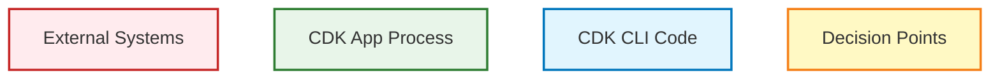

# Deploy Command Technical Architecture

This document provides technical implementation details for contributors debugging or modifying the `cdk deploy` command. It shows the exact function calls and file locations in the execution path.

For a high-level conceptual overview of the deploy process, see the [README](../README.md#deploy-flowchart).

## Technical Flowchart

```mermaid
graph TD
    %% CLI Entry Point
    n1["cdk deploy<br/>(User Command)"]
    n2["cli.ts: exec()"]
    n3["cli.ts: main()"]
    
    %% Deploy Method
    n4["cdk-toolkit.ts: CdkToolkit.deploy()"]
    n5["cdk-toolkit.ts: selectStacksForDeploy()"]
    n6["Check if synthesis needed"]
    
    %% Synthesis Process
    n7["cloud-executable.ts: doSynthesize()"]
    n29{"Context missing?"}
    n34["cloud-executable.ts: synthesizer()"]
    n9["cli.ts: execProgram()"]
    n10["childProcess.spawn()<br/>(Run CDK App)"]
    n11["CDK App Process Started"]
    n35["CDK App: app.synth()"]
    n36["@aws-cdk/core: synthesize()<br/>Generate CloudFormation JSON"]
    n12["Write templates to cdk.out/"]
    n13["Return CloudAssembly object"]
    
    %% Stack Selection
    n14["cloud-assembly.ts:<br/>assembly.selectStacks()"]
    n15["cloud-assembly.ts:<br/>validateStacks()"]
    n16["Return StackCollection"]
    
    %% Asset Processing
    n17["cdk-toolkit.ts:<br/>ResourceMigrator.tryMigrateResources()"]
    n18["work-graph.ts:<br/>WorkGraphBuilder.build()"]
    n37["work-graph.ts:<br/>analyzeDeploymentOrder()"]
    n19["work-graph.ts:<br/>workGraph.doParallel()"]
    
    %% Parallel Execution Nodes
    n20["asset-build.ts: buildAsset()<br/>(Sequential: concurrency=1)"]
    n21["asset-publishing.ts: publishAsset()<br/>(Parallel: concurrency=8)"]
    n44["deploy-stack.ts: deployStack()<br/>(Parallel: configurable)"]
    n45["await Promise.all()<br/>Wait for dependencies"]
    
    %% Deployment Process
    n22["cdk-toolkit.ts: deployStack()"]
    n23["deploy-stack.ts:<br/>CloudFormationStack.lookup()"]
    n24["deploy-stack.ts:<br/>makeBodyParameter()"]
    n25["deploy-stack.ts:<br/>publishAssets()"]
    n38["deploy-stack.ts:<br/>requireApproval()"]
    
    %% Hotswap Decision
    n30{"--hotswap flag set?"}
    n31["hotswap-deployments.ts:<br/>tryHotswapDeployment()"]
    
    %% Standard CloudFormation Deployment
    n26["deploy-stack.ts:<br/>FullCloudFormationDeployment.performDeployment()"]
    n27["AWS SDK: CloudFormation<br/>createChangeSet() OR<br/>updateStack()"]
    n28["CloudFormation Service"]
    n32["deploy-stack.ts:<br/>StackActivityMonitor.start()"]
    n33["deploy-stack.ts:<br/>waitForStackDeploy()"]
    
    %% Completion
    n39["deploy-stack.ts:<br/>getStackOutputs()"]
    n40["cdk-toolkit.ts:<br/>printStackOutputs()"]
    
    %% Main Flow Connections
    n1 --> n2
    n2 --> n3
    n3 --> n4
    n4 --> n5
    n5 --> n6
    n6 --> n7
    n7 --> n29
    n29 -->|"Yes"| n34
    n34 --> n9
    n9 --> n10
    n10 --> n11
    n11 --> n35
    n35 --> n36
    n36 --> n12
    n12 --> n13
    n13 -->|"Loop if context missing"| n29
    n29 -->|"No"| n14
    n14 --> n15
    n15 --> n16
    n16 --> n17
    n17 --> n18
    n18 --> n37
    n37 --> n19
    
    %% Parallel execution from workGraph.doParallel()
    n19 -.->|"Parallel"| n20
    n19 -.->|"Parallel"| n21
    n19 -.->|"Parallel"| n44
    
    %% Dependency relationships
    n20 --> n45
    n21 --> n45
    n44 --> n45
    n45 --> n22
    n22 --> n23
    n23 --> n24
    n24 --> n25
    n25 --> n38
    n38 --> n30
    n30 -->|"Yes"| n31
    n30 -->|"No"| n26
    n31 --> n39
    n26 --> n27
    n27 --> n28
    n28 --> n32
    n32 --> n33
    n33 --> n39
    n39 --> n40
    
    %% Simplified Color Scheme - Only 3 colors
    %% External Systems (Light Red)
    style n1 fill:#ffebee,stroke:#c62828,stroke-width:2px
    style n28 fill:#ffebee,stroke:#c62828,stroke-width:2px
    
    %% CDK App Process (Light Green)
    style n10 fill:#e8f5e9,stroke:#2e7d32,stroke-width:2px
    style n11 fill:#e8f5e9,stroke:#2e7d32,stroke-width:2px
    style n35 fill:#e8f5e9,stroke:#2e7d32,stroke-width:2px
    style n36 fill:#e8f5e9,stroke:#2e7d32,stroke-width:2px
    style n12 fill:#e8f5e9,stroke:#2e7d32,stroke-width:2px
    
    %% Decision Points (Light Yellow)
    style n29 fill:#fff9c4,stroke:#f57f17,stroke-width:2px
    style n30 fill:#fff9c4,stroke:#f57f17,stroke-width:2px
    style n38 fill:#fff9c4,stroke:#f57f17,stroke-width:2px
    style n45 fill:#fff9c4,stroke:#f57f17,stroke-width:2px
    
    %% Everything else - CDK CLI Code (Light Blue)
    style n2 fill:#e1f5fe,stroke:#0277bd,stroke-width:2px
    style n3 fill:#e1f5fe,stroke:#0277bd,stroke-width:2px
    style n4 fill:#e1f5fe,stroke:#0277bd,stroke-width:2px
    style n5 fill:#e1f5fe,stroke:#0277bd,stroke-width:2px
    style n6 fill:#e1f5fe,stroke:#0277bd,stroke-width:2px
    style n7 fill:#e1f5fe,stroke:#0277bd,stroke-width:2px
    style n9 fill:#e1f5fe,stroke:#0277bd,stroke-width:2px
    style n13 fill:#e1f5fe,stroke:#0277bd,stroke-width:2px
    style n14 fill:#e1f5fe,stroke:#0277bd,stroke-width:2px
    style n15 fill:#e1f5fe,stroke:#0277bd,stroke-width:2px
    style n16 fill:#e1f5fe,stroke:#0277bd,stroke-width:2px
    style n17 fill:#e1f5fe,stroke:#0277bd,stroke-width:2px
    style n18 fill:#e1f5fe,stroke:#0277bd,stroke-width:2px
    style n19 fill:#e1f5fe,stroke:#0277bd,stroke-width:3px
    style n20 fill:#e1f5fe,stroke:#0277bd,stroke-width:2px
    style n21 fill:#e1f5fe,stroke:#0277bd,stroke-width:2px
    style n22 fill:#e1f5fe,stroke:#0277bd,stroke-width:2px
    style n23 fill:#e1f5fe,stroke:#0277bd,stroke-width:2px
    style n24 fill:#e1f5fe,stroke:#0277bd,stroke-width:2px
    style n25 fill:#e1f5fe,stroke:#0277bd,stroke-width:2px
    style n26 fill:#e1f5fe,stroke:#0277bd,stroke-width:2px
    style n27 fill:#e1f5fe,stroke:#0277bd,stroke-width:2px
    style n31 fill:#e1f5fe,stroke:#0277bd,stroke-width:2px
    style n32 fill:#e1f5fe,stroke:#0277bd,stroke-width:2px
    style n33 fill:#e1f5fe,stroke:#0277bd,stroke-width:2px
    style n34 fill:#e1f5fe,stroke:#0277bd,stroke-width:2px
    style n37 fill:#e1f5fe,stroke:#0277bd,stroke-width:2px
    style n39 fill:#e1f5fe,stroke:#0277bd,stroke-width:2px
    style n40 fill:#e1f5fe,stroke:#0277bd,stroke-width:2px
    style n44 fill:#e1f5fe,stroke:#0277bd,stroke-width:2px
    
```

## Legend (Node Categories)

## Parallel Execution Model

The deploy process uses a sophisticated work graph (`workGraph.doParallel()` in `work-graph.ts`) to manage parallel execution:

- **Asset Building** (concurrency: 1): Compiles Docker images, Lambda code, etc. sequentially to avoid overwhelming system resources
- **Asset Publishing** (concurrency: 8): Uploads assets to S3/ECR in parallel for faster deployment
- **Stack Deployment** (configurable): Deploys multiple stacks in parallel while respecting dependencies

The dotted lines indicate parallel execution paths from the work graph orchestrator. All operations respect dependency relationships before proceeding (node n45 represents the synchronization point).
